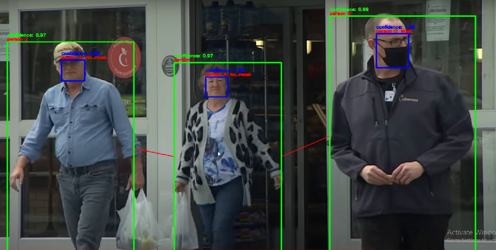
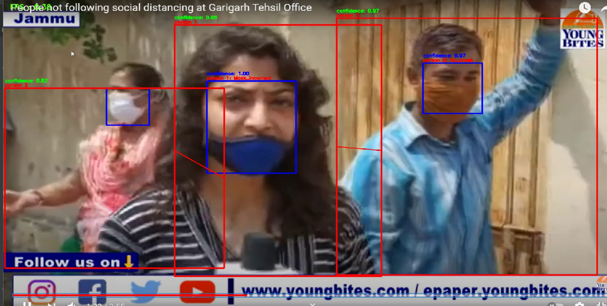
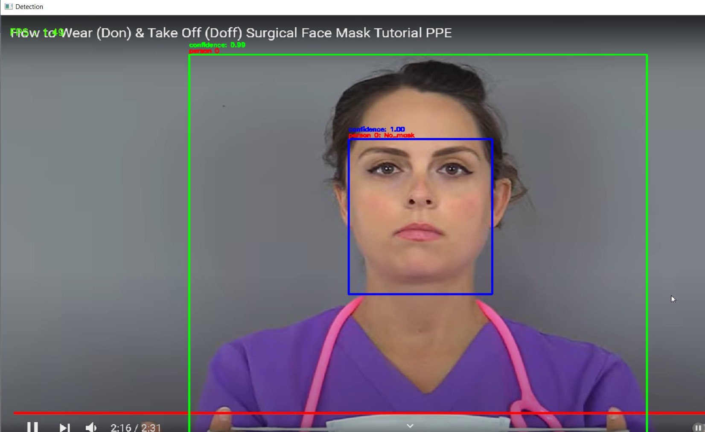
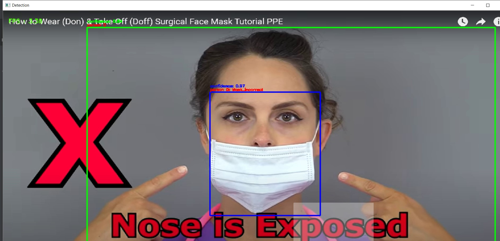
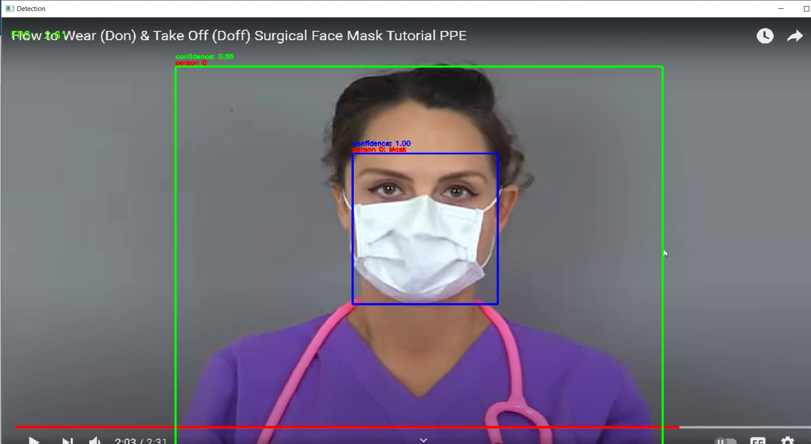

# Social-Distancing-with-Mask-Detection

This Application can accept live web cam video and recorded video as input.

Here Green Boxes indicate that social distancing is followed

Here Social distancing is not following which is indicated by Red Boxes

No Mask

Mask Weared Incorrect

Person wearing Mask

